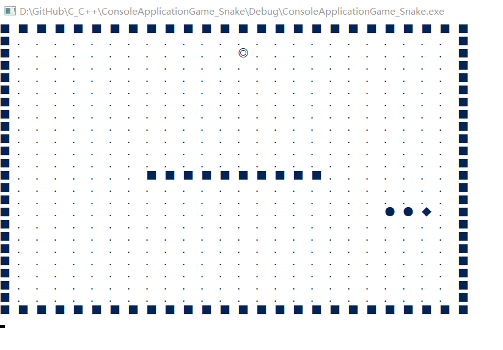
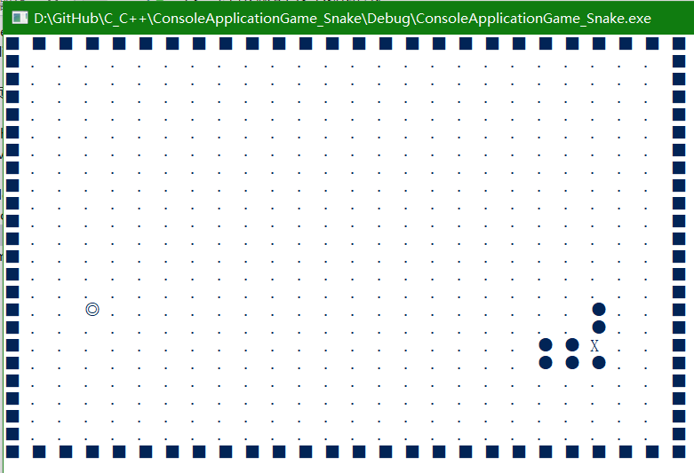
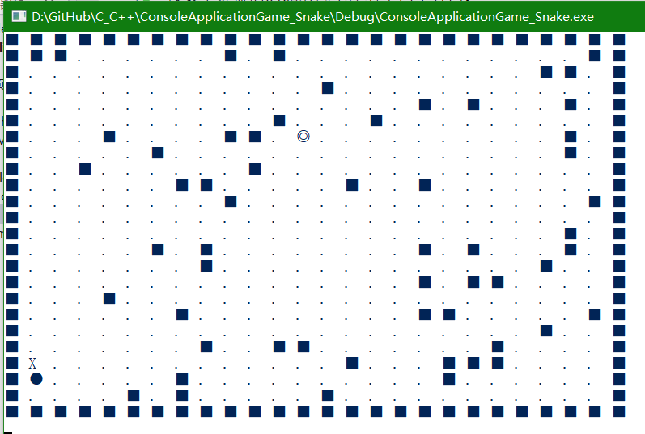
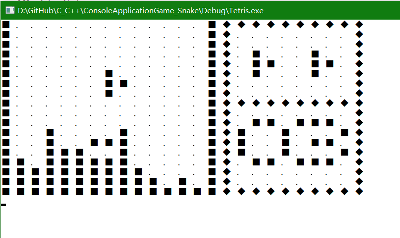
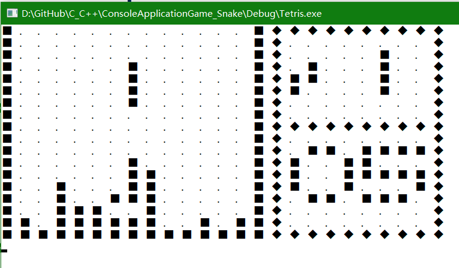

大一时候做的贪吃蛇游戏
### 项目名：
ConsoleApplicationGame_Snake

### 操作方法，
按数字键盘的8462对应上左右下四个方向：

7 | 8(上)|	9
--|--|--
4（左）	|	5	|	6（右）
1	|	2（下）	|	3

### 贪吃蛇游戏截图：

大一时做的俄罗斯方块：
### 项目名：
Teris

### 操作方法

7 | 8|	9
--|--|--
4（左）	|	5（旋转方块）	|	6（右）
1	|	2（下）	|	3

### 俄罗斯方块游戏截图：

