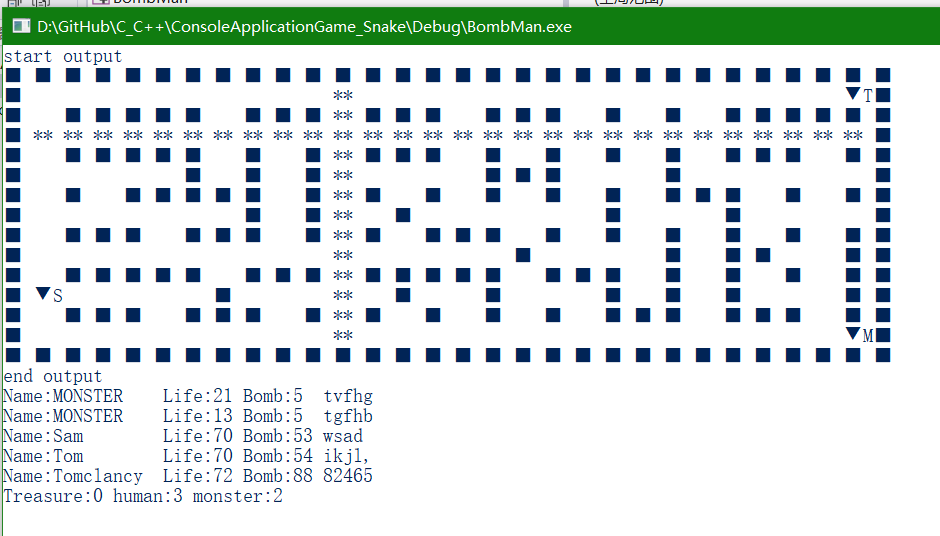
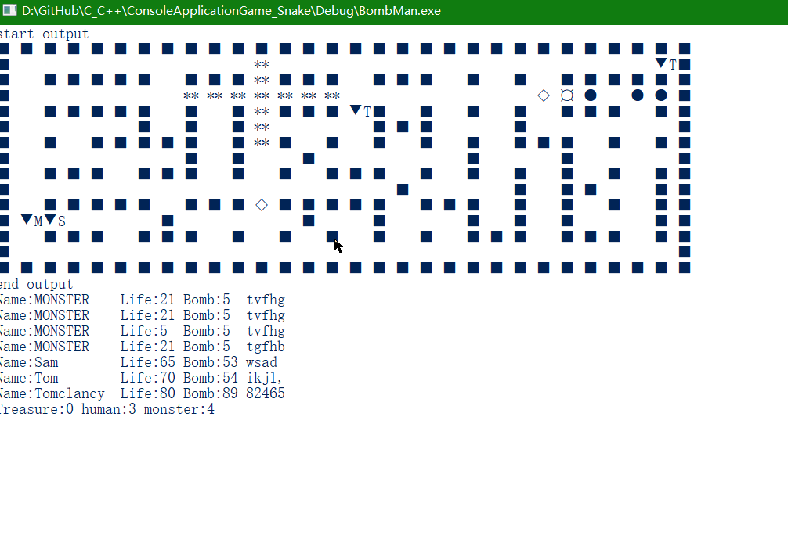

## 贪吃蛇游戏
### 项目名：
ConsoleApplicationGame_Snake

### 操作方法，
按数字键盘的8462对应上左右下四个方向：

7 | 8(上)|	9
--|--|--
4（左）	|	5	|	6（右）
1	|	2（下）	|	3

### 贪吃蛇游戏截图：

----

## 俄罗斯方块
### 项目名：Teris

### 操作方法

7 | 8|	9
--|--|--
4（左）	|	5（旋转方块）	|	6（右）
1	|	2（下）	|	3

### 游戏介绍
右上角显示接下来将出现的两个方块。  
右下角显示得到的分数。  
随着分数和游戏时间的增加，游戏的速度会越来越快。

### 俄罗斯方块游戏截图：

---
## 炸弹超人
### 项目名：BombMan

### 游戏介绍
这个游戏最多允许三个玩家，每个玩家控制一个对应的键位，分配控制角色的上下左右和放置炸弹。  
具体的操作方法会实时的显示在游戏屏幕的下方，每个角色的旁边会显示对应角色名字的头一个字母。
而且允许其中一个玩家扮演怪物来对抗其他玩家，这个玩家（扮演怪物）没有炸弹，但是拥有普通怪物的攻击方式。

#### 目标
游戏中存在被掩埋的宝藏，玩家需要用炸弹炸开那些墙（有的墙炸不开）， 然后获取宝藏，墙下面可能是一个超级炸弹（伤害范围广）、炸弹补给或者怪物巢穴，
怪物巢穴会生成一定数量的怪物攻击玩家，玩家的生命值耗尽时就会死亡，一旦所有的玩家死亡，游戏失败，重头再来。  
目前游戏只有两个关卡。

#### 游戏符号的含义：

符号 | 含义
----|-----
▼M   | 扮演怪物的玩家
▼   | 普通玩家
◆   | 炸弹
◇   | 炸弹补给
★   | 宝藏
¤   | 怪物巢穴
●   | 怪物
■   | 墙
**   | 炸弹产生的火焰

在界面的最下面会显示游戏中所有对象的属性，名称为**MONSTER**的是怪物，它的*Bomb*属性表示它的攻击力。
名称为其他的表示玩家，它们的*Bomb*表示玩家剩余的炸弹数量，玩家最后面的五个字符对应的是这个玩家的**控制按键**，分别对应上下左右和放置炸弹。
*（注：第一个玩家的wsad后面有一个空格）*

### 游戏截图

